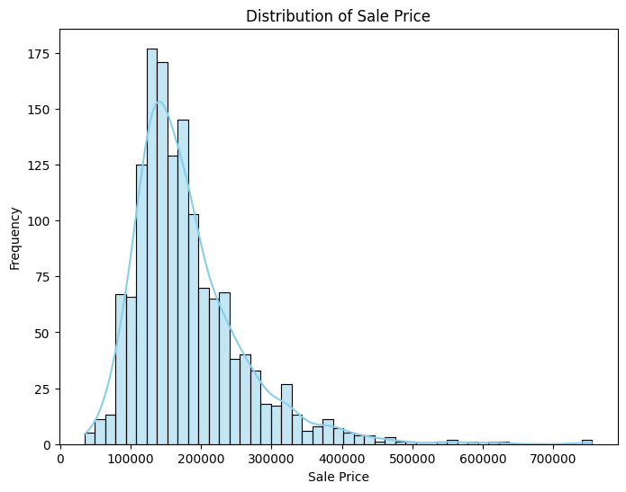

# 🏠 House Prices Prediction


**End-to-end machine learning pipeline** for predicting house prices using regression models.  
Currently implemented: **Linear Regression** achieving a normalized **RMSE ~0.15** on validation data.  

---

## 📌 Project Overview
This project explores how property attributes (size, quality, neighborhood, etc.) influence sale prices and builds a predictive model.  
It demonstrates the full pipeline of a machine learning project:
- **Data preprocessing** – Handling missing values, encoding categorical variables.
- **Exploratory Data Analysis (EDA)** – Understanding the key factors affecting house prices.
- **Baseline modeling** – Linear Regression for initial predictions.
- **Evaluation** – RMSE as the primary performance metric.

---

## 🎯 Key Insights
- Preprocessed **80+ features** with missing values and categorical encoding (one-hot).
- Explored **correlations** between features and sale price.
- Built a baseline model and analyzed its performance.
- Learned the impact of feature engineering on model performance.

---

## 📊 Dataset
- **Source**: [Kaggle – House Prices: Advanced Regression Techniques](https://www.kaggle.com/c/house-prices-advanced-regression-techniques)
- **Training set**: 1460 samples with 80 features + SalePrice target.
- **Test set**: 1459 samples for evaluation.

---

## 📷 Key Visualizations
| Distribution of Sale Prices | Feature Correlation |
|-----------------------------|---------------------|
|  |  |

| Model RMSE Comparison | Model Metrics (MSE, RMSE, R²) |
|-----------------------|--------------------------------|
|  |  |

---

## 🛠️ Project Structure
```
house-prices-prediction/
├─ data/                   # Training & test datasets
│   ├─ train.csv
│   └─ test.csv
├─ images/                 # Visualizations
│   ├─ distribution_sale_price.png
│   ├─ heatmap_correlation.png
│   ├─ model_rmse_comparison.png
│   └─ model_metrics_comparison.png
├─ src/                    # Code & utilities
│   ├─ functions.py
│   └─ requirements.txt
├─ House_Prices.ipynb      # Main Jupyter Notebook
└─ README.md               # Project documentation
```

---

## ⚡ How to Run
1. Clone repository:
   ```bash
   git clone https://github.com/Rotem-Shimon/house-prices-prediction.git
   ```
2. Install dependencies:
   ```bash
   pip install -r src/requirements.txt
   ```
3. Open Notebook:
   ```bash
   jupyter notebook House_Prices.ipynb
   ```
4. Run all cells to reproduce analysis and results.

---

## 👨‍💻 Author
**Rotem Shimon**  
2nd-year Computer Science student at Afeka Academic College of Engineering.  
Passionate about data science, machine learning, and building practical solutions.
